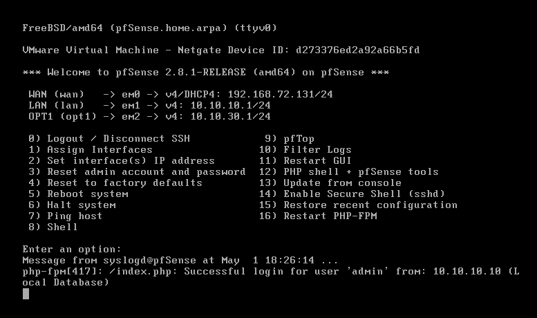
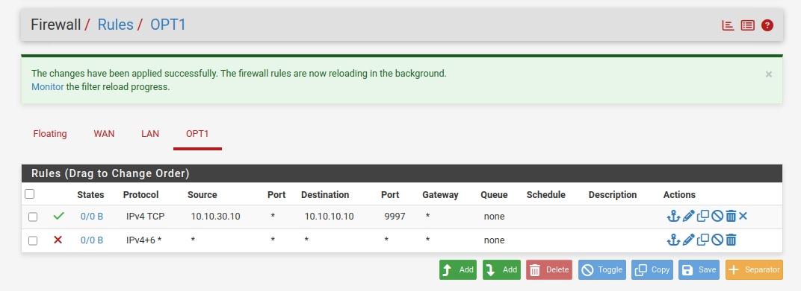

# SIEM-Splunk-pfSense-Lab-
Hands-on SOC lab using Splunk Enterprise, pfSense, and Windows endpoint telemetry.

SIEM Splunk Lab (pfSense + Windows)
## Overview

This project is a hands-on Security Operations Center (SOC) lab built using Splunk Enterprise, pfSense firewall, and a Windows endpoint.

The goal was to simulate a realistic SOC environment and go through the full workflow — starting from log collection, moving into detection engineering, then validating detections through attack simulation, and finally performing basic incident response.

The focus of this lab is not just deploying tools, but understanding how they work together in a practical defensive security setup.

Lab Architecture

The lab includes three main systems:

Splunk Server (Ubuntu): "10.10.10.10"
Windows Client: "10.10.30.10"
pfSense Firewall (used for network segmentation and traffic control)

Network segmentation was implemented to isolate systems and control communication between subnets, making the setup closer to a real environment.

## Phase 1: Infrastructure Setup

This phase focused on building the foundation:

- Created three virtual machines (Ubuntu, Windows, pfSense)
- Configured segmented networks using pfSense
- Applied firewall rules to control traffic between subnets

At this stage, the environment was ready for data ingestion and monitoring.

### pfSense Interfaces

### Firewall Rules

## Phase 2: Log Collection

The objective here was to get meaningful data into Splunk:

Installed Splunk Enterprise on Ubuntu
Enabled receiving on port 9997
Installed Splunk Universal Forwarder on the Windows endpoint
Collected Windows Event Logs:
Security
System
Application

This phase established the data pipeline required for detection and analysis.

## Phase 3: Detection Engineering

In this phase, raw logs were converted into actionable detections:

Developed detection rules using SPL
Built correlation searches to identify suspicious patterns
Implemented severity levels (High / Medium / Low)
Reduced noise by filtering out low-value or redundant events

The goal here was to create useful alerts instead of overwhelming noise.

## Phase 4: Attack Simulation

To test the detection logic, different attack scenarios were simulated:

Brute-force login attempts
Execution of suspicious PowerShell commands
Observing how these activities appeared in Splunk

This helped validate whether the detections were actually effective.

## Phase 5: Incident Response

This phase covered basic response actions:

Identified suspicious activity
Investigated events using Splunk searches
Applied basic containment actions
Performed initial analysis of the incident

This completed the end-to-end SOC workflow from detection to response.

Key Skills Demonstrated
SIEM deployment and configuration (Splunk)
Log collection and analysis
Detection engineering and alert tuning
Network segmentation using pfSense
End-to-end blue team workflow
