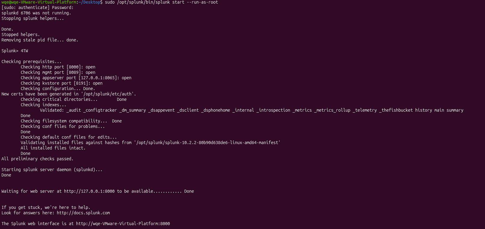
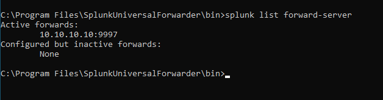
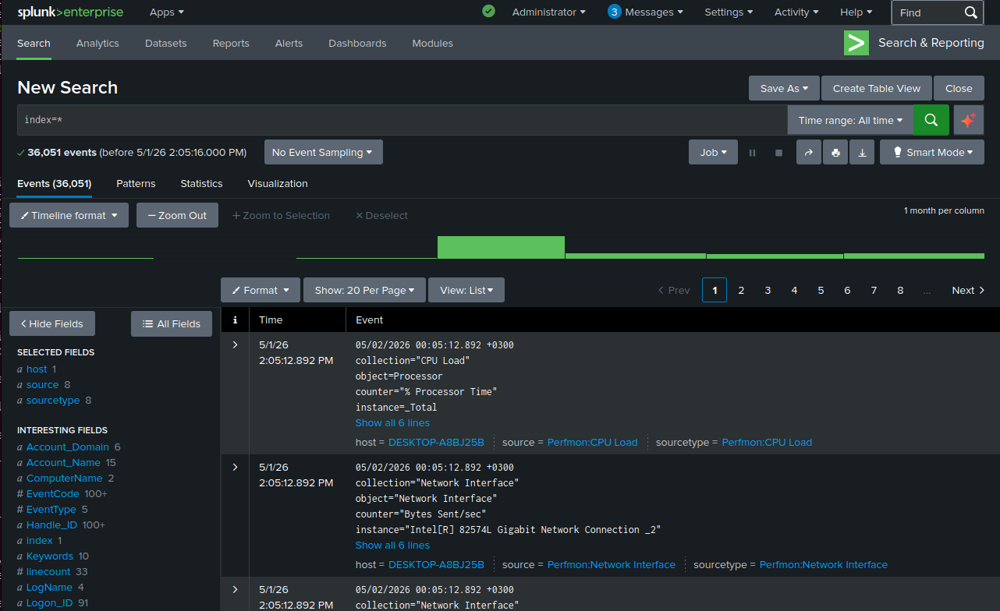
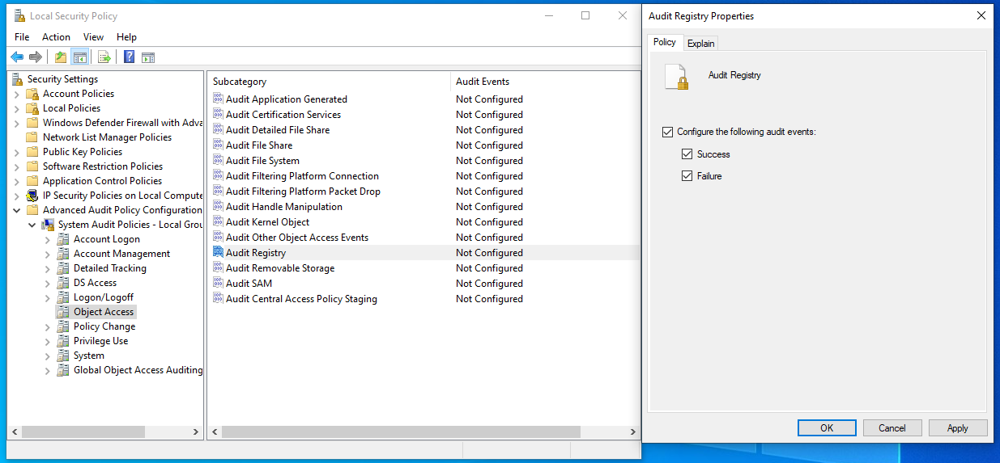
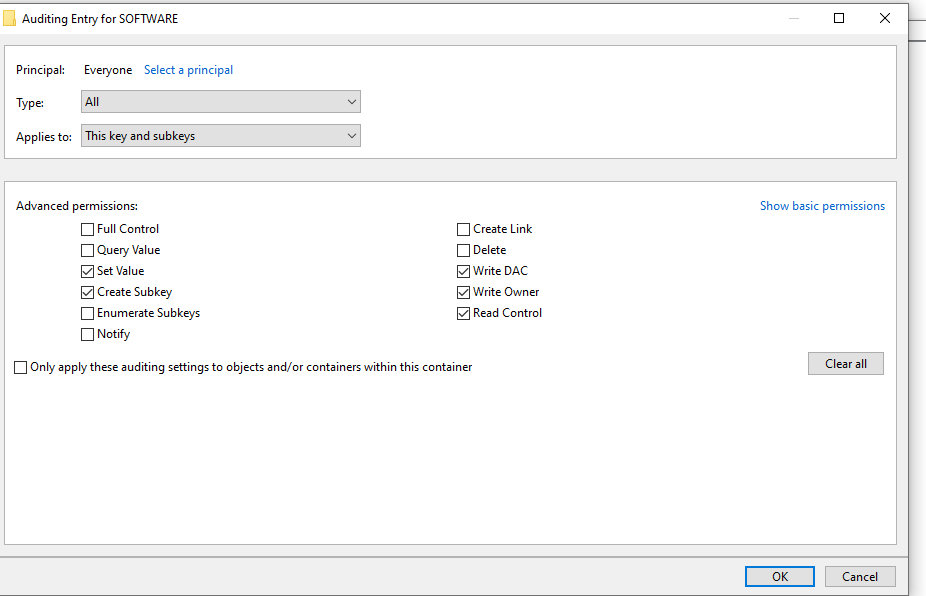
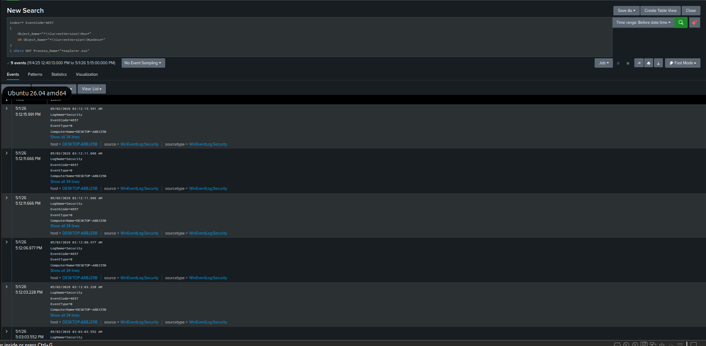
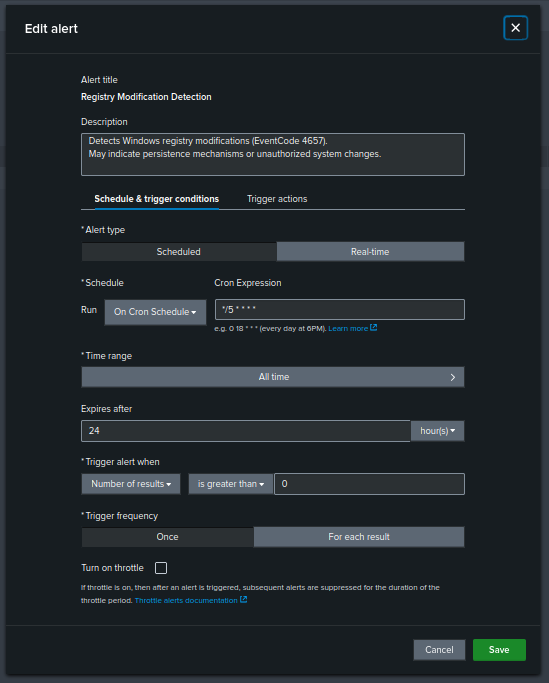
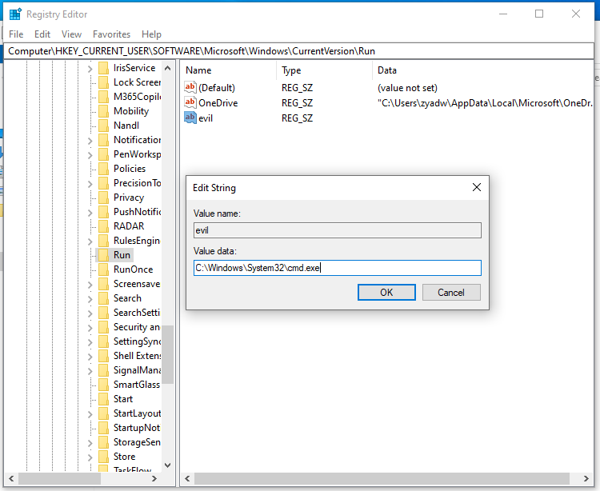
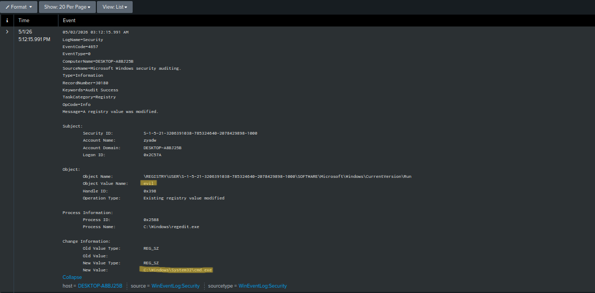

# SIEM-Splunk-pfSense-Lab-
Hands-on SOC lab using Splunk Enterprise, pfSense, and Windows endpoint telemetry.

SIEM Splunk Lab (pfSense + Windows)
## Overview

This project is a hands-on Security Operations Center (SOC) lab built using Splunk Enterprise, pfSense firewall, and a Windows endpoint.

The goal was to simulate a realistic SOC environment and go through the full workflow — starting from log collection, moving into detection engineering, then validating detections through attack simulation, and finally performing basic incident response.

The focus of this lab is not just deploying tools, but understanding how they work together in a practical defensive security setup.

Lab Architecture

The lab includes three main systems:

Splunk Server (Ubuntu): "10.10.10.10"
Windows Client: "10.10.30.10"
pfSense Firewall (used for network segmentation and traffic control)

Network segmentation was implemented to isolate systems and control communication between subnets, making the setup closer to a real environment.

## Phase 1: Infrastructure Setup

This phase focused on building the foundation:

- Created three virtual machines (Ubuntu, Windows, pfSense)
- Configured segmented networks using pfSense
- Applied firewall rules to control traffic between subnets

At this stage, the environment was ready for data ingestion and monitoring.

### pfSense Interfaces


### Firewall Rules


## Phase 2: Log Collection

The objective here was to get meaningful data into Splunk:

- Installed Splunk Enterprise on Ubuntu
- Enabled receiving on port 9997
- Installed Splunk Universal Forwarder on the Windows endpoint
- Collected Windows Event Logs:
  - Security
  - System
  - Application

### Splunk Server Status


### Forwarder Connection


### Splunk Logs (index=*)


This phase established the data pipeline required for detection and analysis.

## Phase 3: Detection Engineering

After confirming that Windows logs were successfully reaching Splunk, the next step was to turn raw events into useful detections.

The first detection use case focused on registry-based persistence. This technique is commonly used by malware to maintain access by adding a value under Windows Run keys, allowing a program to start automatically when the user logs in.

### Registry Persistence Detection

Windows Registry auditing was enabled on the endpoint to generate security events when registry keys or values are modified.



Registry auditing was then configured on `HKCU\Software` to monitor changes under the user registry hive.



The detection focused on suspicious changes to Run and RunOnce registry keys.

```spl
index=* EventCode=4657
(
    Object_Name="*\\CurrentVersion\\Run*"
    OR Object_Name="*\\CurrentVersion\\RunOnce*"
)
| where NOT Process_Name="*explorer.exe"
```



A Splunk alert was configured to trigger when suspicious registry persistence activity is detected.



## Phase 4: Attack Simulation and Validation

To test the detection, I simulated a simple registry persistence technique on the Windows endpoint.

A new registry value named `evil` was created under the Windows Run key:

```text
HKCU\Software\Microsoft\Windows\CurrentVersion\Run
```

The value was configured to run:

```text
C:\Windows\System32\cmd.exe
```

This type of registry location is commonly abused because anything placed under the Run key can execute when the user logs in.



After creating and modifying the registry value, Splunk captured the activity as Windows Security EventCode `4657`.



The event showed the registry path, the value name `evil`, the new value data, and the process responsible for the change. This confirmed that the Windows auditing configuration, Universal Forwarder, Splunk search, and alerting logic were working as expected.
## Phase 5: Incident Response

This phase covered basic response actions:

Identified suspicious activity
Investigated events using Splunk searches
Applied basic containment actions
Performed initial analysis of the incident

This completed the end-to-end SOC workflow from detection to response.

Key Skills Demonstrated
SIEM deployment and configuration (Splunk)
Log collection and analysis
Detection engineering and alert tuning
Network segmentation using pfSense
End-to-end blue team workflow
