# SIEM-Splunk-pfSense-Lab

Hands-on SOC lab using Splunk Enterprise, pfSense, and Windows endpoint telemetry.

## Overview

This project is a hands-on Security Operations Center (SOC) lab built using Splunk Enterprise, pfSense firewall, and a Windows endpoint.

The goal was to build a small but realistic SOC environment and walk through the full workflow: setting up the lab, collecting logs, building detections, validating them through attack simulation, and responding to a ransomware incident.

This lab focuses on understanding how the tools work together in a practical blue team setup, not just installing them.

## Lab Architecture

The lab includes three main systems:

- Splunk Server (Ubuntu): `10.10.10.10`
- Windows Client: `10.10.30.10`
- pfSense Firewall: used for network segmentation and traffic control

Network segmentation was implemented to isolate systems and control communication between subnets.

## Phase 1: Infrastructure Setup

This phase focused on building the foundation of the lab.

Tasks completed:

- Created three virtual machines: Ubuntu, Windows, and pfSense
- Configured segmented networks using pfSense
- Applied firewall rules to control traffic between subnets

At this stage, the environment was ready for log collection and monitoring.

### pfSense Interfaces

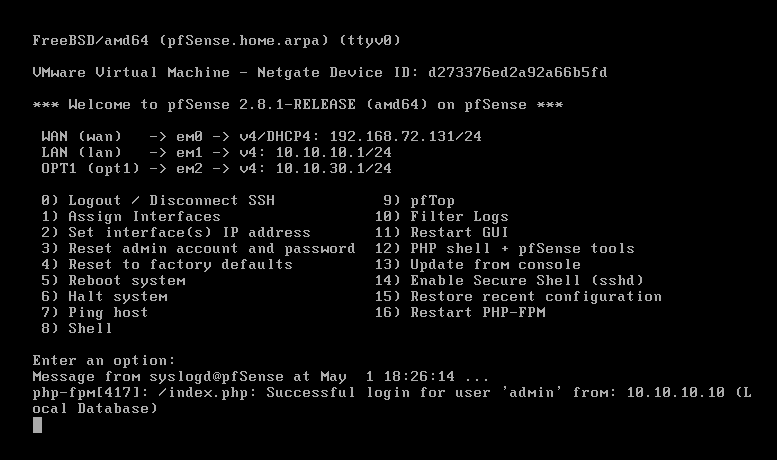

### Firewall Rules

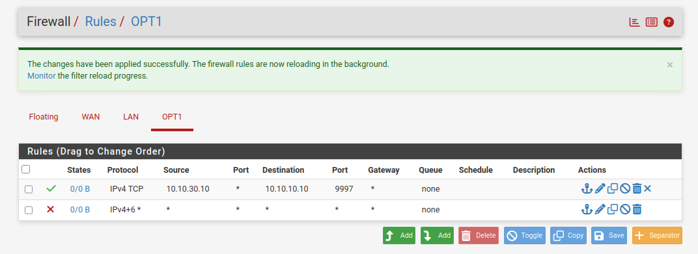

## Phase 2: Log Collection

The goal of this phase was to get meaningful Windows logs into Splunk.

Tasks completed:

- Installed Splunk Enterprise on Ubuntu
- Enabled Splunk receiving on port `9997`
- Installed Splunk Universal Forwarder on the Windows endpoint
- Collected Windows Event Logs:
  - Security
  - System
  - Application

### Splunk Server Status

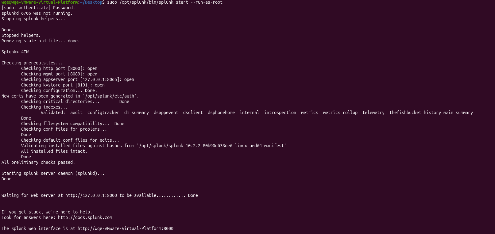

### Forwarder Connection

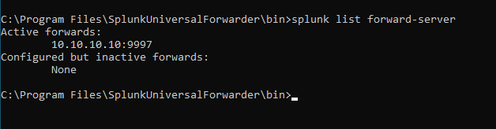

### Splunk Logs

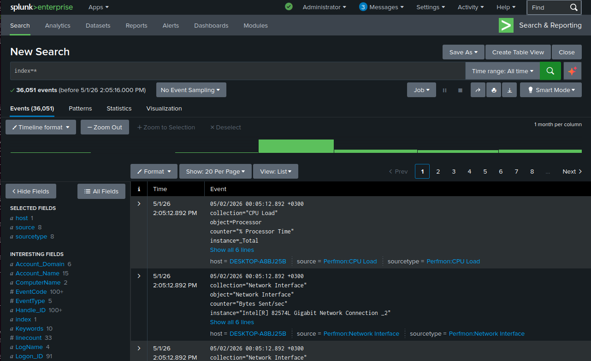

This phase confirmed that the Windows endpoint was successfully sending logs to Splunk.

## Phase 3: Detection Engineering

After confirming that Windows logs were reaching Splunk, the next step was to turn raw events into useful detections.

The first detection focused on registry-based persistence. This is a common technique where malware or an attacker adds a value under Windows Run keys so a program starts automatically when the user logs in.

### Registry Persistence Detection

Windows Registry auditing was enabled on the endpoint to generate security events when registry keys or values are modified.

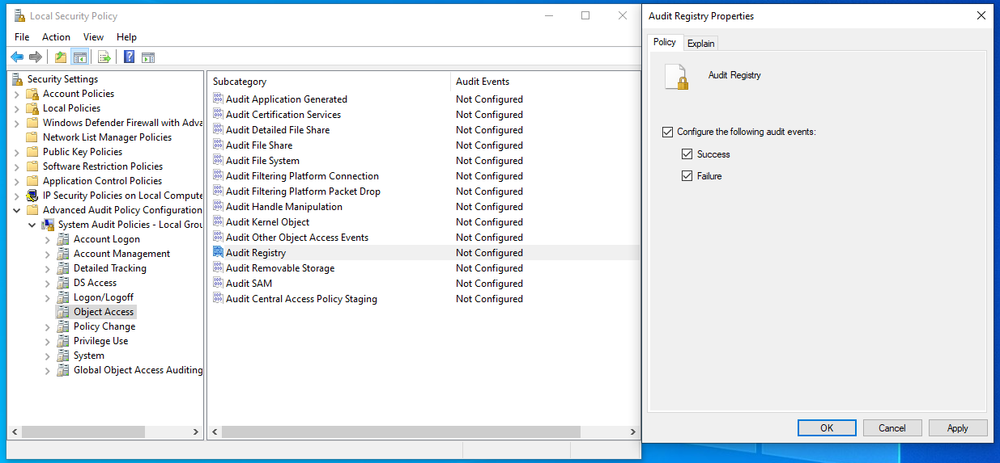

Registry auditing was then configured on `HKCU\Software` to monitor changes under the user registry hive.

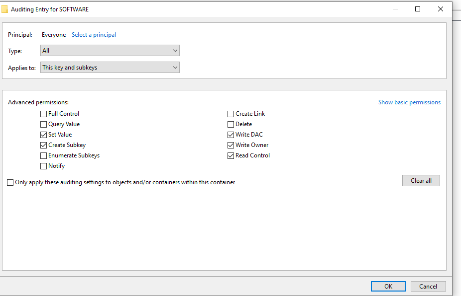

The detection focused on suspicious changes to Run and RunOnce registry keys.

```spl
index=* EventCode=4657
(
    Object_Name="*\\CurrentVersion\\Run*"
    OR Object_Name="*\\CurrentVersion\\RunOnce*"
)
| where NOT Process_Name="*explorer.exe"
```

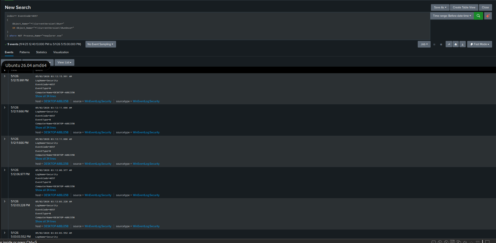

A Splunk alert was configured to trigger when suspicious registry persistence activity is detected.

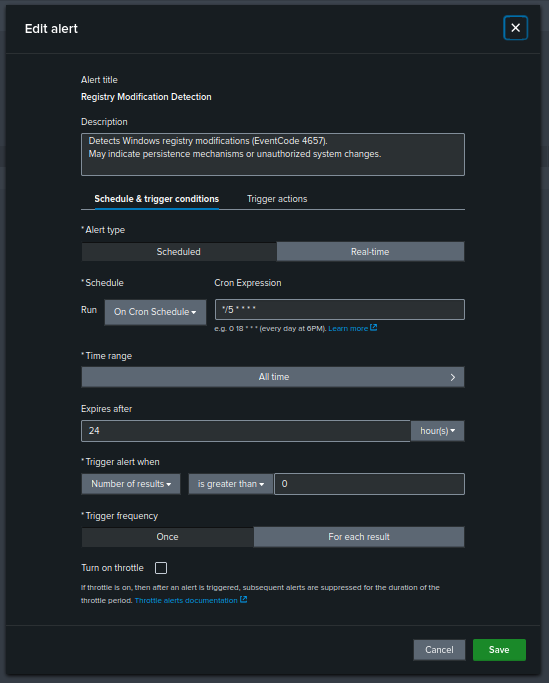

## Phase 4: Attack Simulation and Validation

To test the detection, I simulated a simple registry persistence technique on the Windows endpoint.

A new registry value named `evil` was created under the Windows Run key:

```text
HKCU\Software\Microsoft\Windows\CurrentVersion\Run
```

The value was configured to run:

```text
C:\Windows\System32\cmd.exe
```

This registry location is commonly abused because values placed under the Run key can execute when the user logs in.

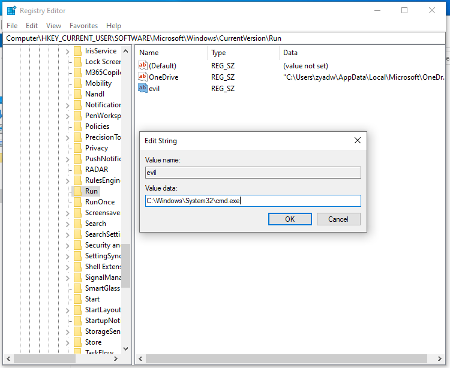

After creating and modifying the registry value, Splunk captured the activity as Windows Security EventCode `4657`.

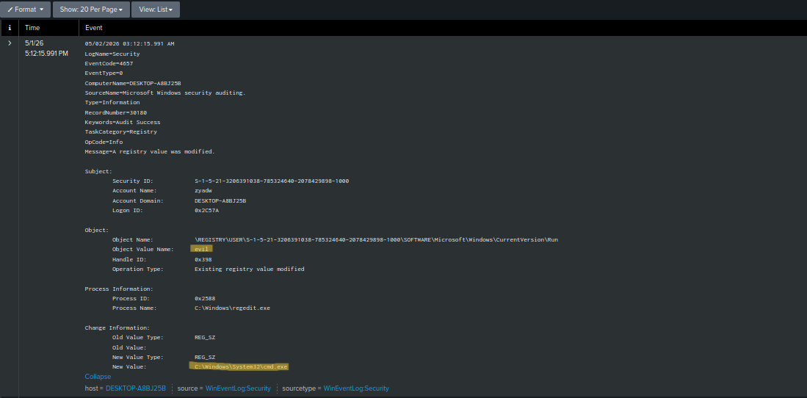

The event showed the registry path, the value name `evil`, the new value data, and the process responsible for the change. This confirmed that the auditing configuration, Splunk forwarding, search logic, and alerting workflow were working correctly.

## Phase 5: Ransomware Incident Response

In this phase, a WannaCry ransomware sample was executed inside the isolated Windows VM to simulate a ransomware incident and practice the response workflow.

The goal was to observe the behavior, collect evidence, contain the host, review logs, remove the threat, and recover from a clean snapshot.

### Initial Execution

Before execution, the sample was placed inside the Windows VM along with test files used to observe the impact.

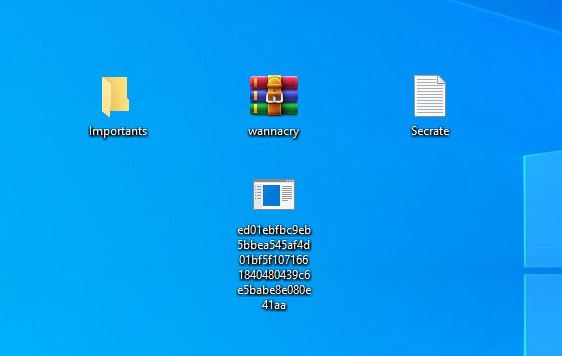

After execution, the WannaCry ransom note appeared on the endpoint, confirming active ransomware behavior.

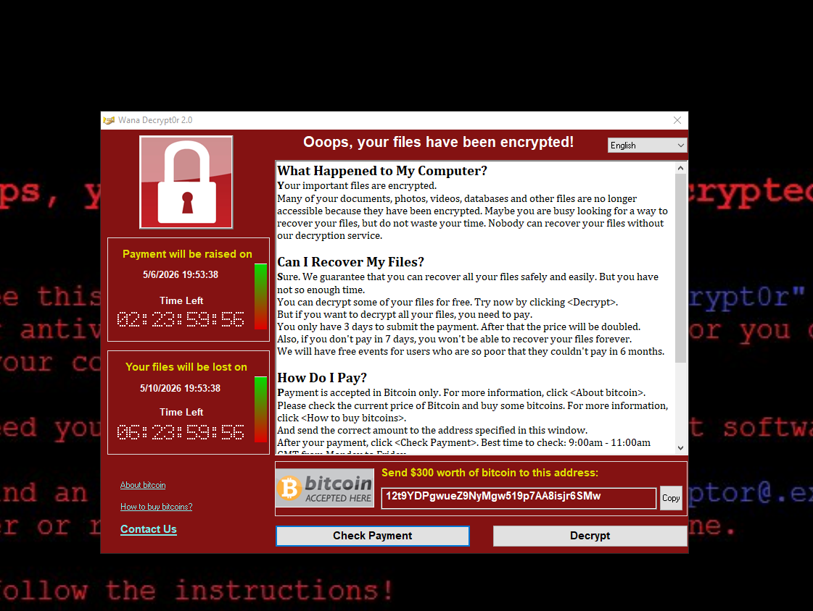

### Impact and Artifacts

The ransomware created several WannaCry-related files and artifacts on the desktop, including `.wnry` files and `@WanaDecryptor@` components.

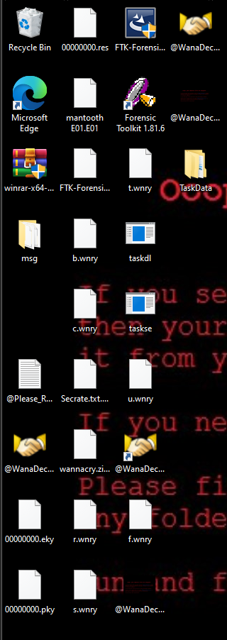

An affected file was opened after execution. The file content appeared unreadable, confirming that the original data had been encrypted.

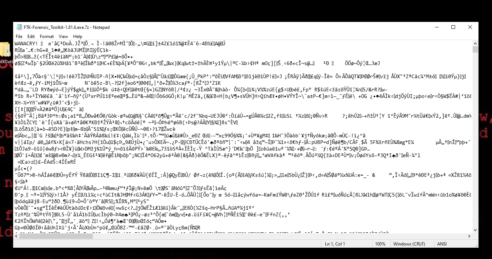

### Splunk Detection

Splunk captured Windows Security EventCode `4688`, showing process execution related to the ransomware activity.

The observed processes included:

- `taskdl.exe`
- `taskse.exe`
- `@WanaDecryptor@.exe`

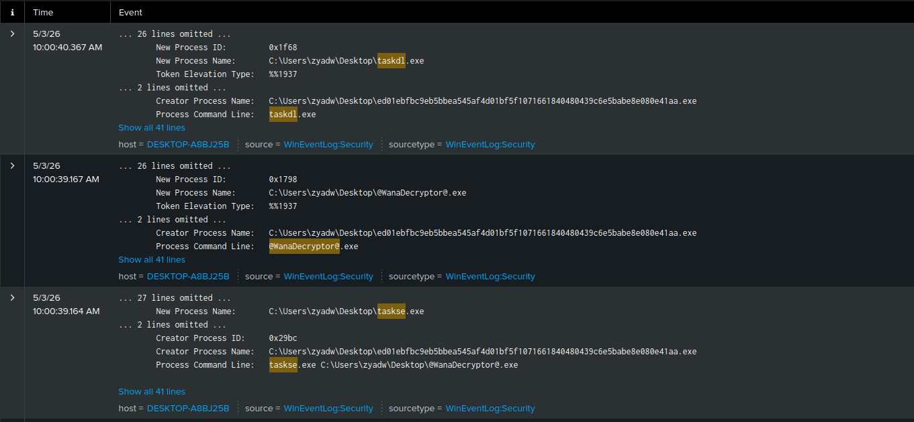

This confirmed that Windows process creation auditing and Splunk log ingestion were working as expected.

### Containment

After confirming ransomware execution, the infected Windows VM was isolated using pfSense firewall rules to prevent further communication and possible lateral movement.

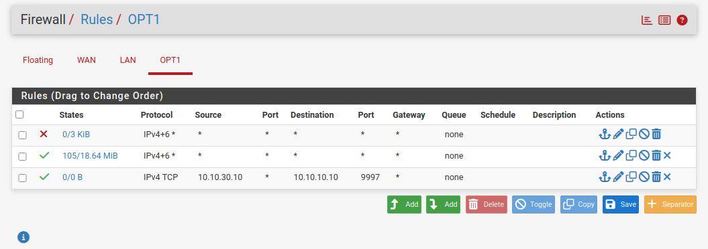

### Eradication

Microsoft Defender detected the ransomware as `Ransom:Win32/WannaCrypt` and generated a ransomware alert.

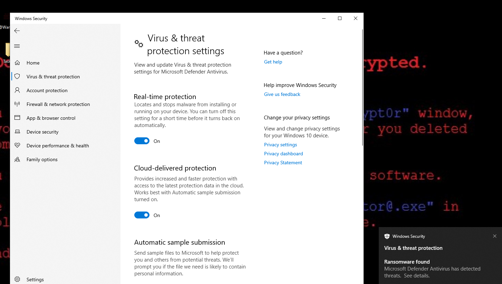

The detected ransomware artifact was then quarantined by Microsoft Defender.

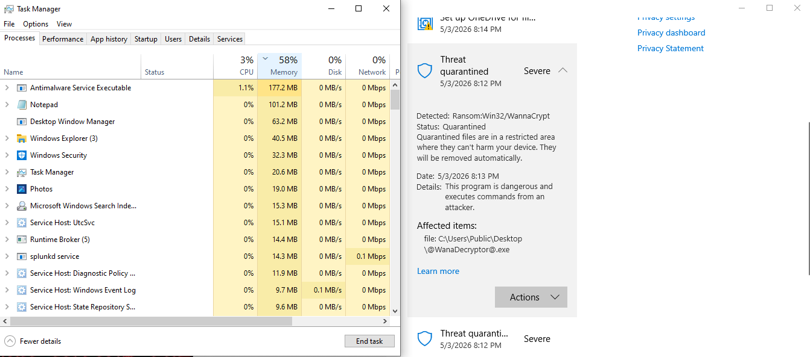

### Recovery

Because the encrypted files could not be safely decrypted, recovery was done by restoring the Windows VM from a clean snapshot instead of attempting manual decryption.

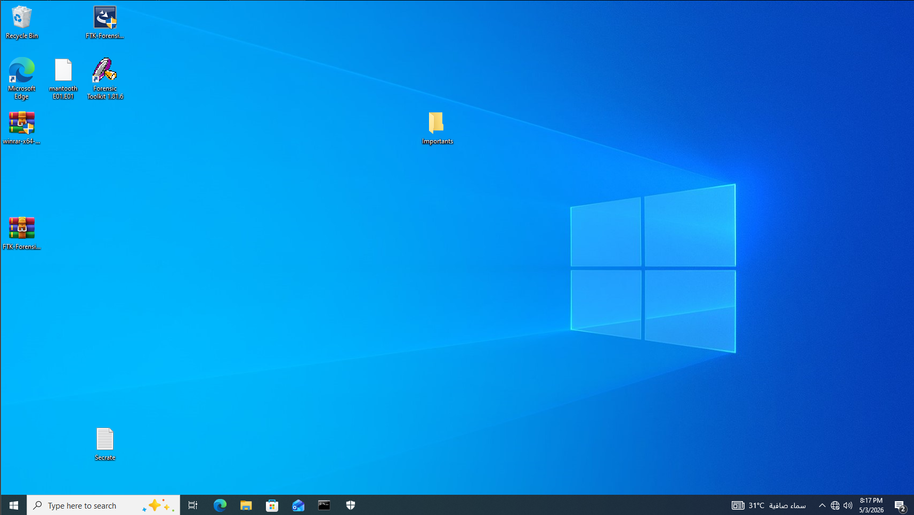

### Lessons Learned

This phase showed that ransomware response is more than just detecting malware. A complete response includes confirming execution, identifying impact, isolating the affected host, reviewing security logs, removing the threat, and recovering from a trusted backup or snapshot.

Key takeaways:

- Ransomware should be handled as a high-severity incident.
- Immediate containment is important to reduce the risk of spread.
- Process creation logs are useful for identifying malware execution.
- Endpoint protection and SIEM visibility work better together.
- Backups and snapshots are essential when encrypted files cannot be safely decrypted.

## Key Skills Demonstrated

- SIEM deployment and configuration using Splunk Enterprise
- Windows log collection using Splunk Universal Forwarder
- Windows Event Log analysis
- Detection engineering using SPL
- Registry persistence detection
- Process execution monitoring with EventCode `4688`
- Alert creation and tuning in Splunk
- Network segmentation using pfSense
- Ransomware behavior analysis
- Incident response workflow: detection, containment, eradication, and recovery
- Snapshot-based recovery after ransomware impact
